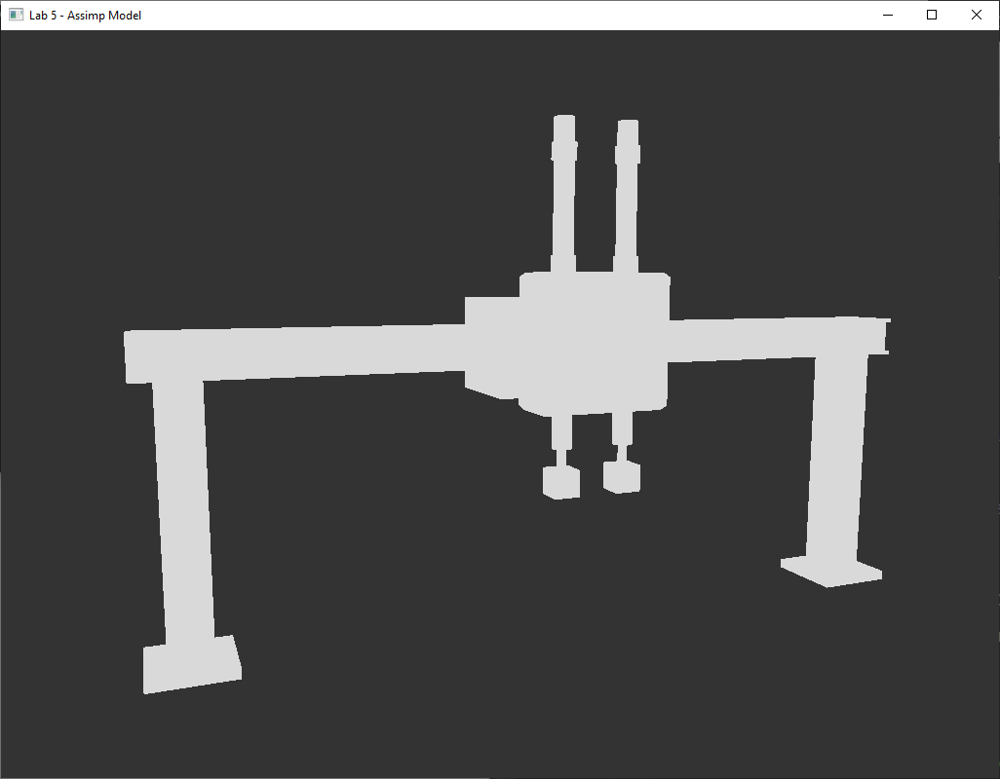

## Лабораторная работа №5:
### Подключение и работа с библиотекой ASSIMP. Настройка импорта модели.

**Цель:** подключить библиотеку **ASSIMP** и реализовать импорт 3D-модели в формате **.obj** для дальнейшего рендера и работы с данными модели.

### Основные идеи
В этой лабораторной работе выполняется переход от вручную заданной геометрии к загрузке готовой 3D-модели из файла.  
Библиотека **ASSIMP** загружает модель как структуру сцены, после чего данные извлекаются через обход узлов и мешей.  
На этой основе формируются собственные классы **Model** и **Mesh**, которые подготавливают модель к отрисовке в OpenGL.  

### Что реализовано
- подключена библиотека **ASSIMP** к проекту;
- реализована загрузка `.obj`-модели через `Assimp::Importer::ReadFile(...)`;
- выполнен разбор структуры модели **Scene → Node → Mesh** с рекурсивным обходом узлов сцены;
- реализован класс **Mesh**, который хранит вершины, нормали и индексы, а также настраивает **VAO / VBO / EBO**;
- реализован класс **Model**, который загружает сцену, извлекает меши и отрисовывает модель как набор частей;
- из модели извлекаются координаты вершин, нормали и индексы;
- выполнена проверка загрузки как на тестовой `.obj`-модели, так и на собственной модели робота, экспортированной из Blender;
- для отображения модели используется шейдер `model.vert / model.frag`.

### Особенности реализации
Для упрощённой проверки импорта в шейдере используется однотонная плоская заливка через `uniform vec3 lightColor`.  
При этом в модель уже загружаются не только координаты вершин, но и нормали, чтобы подготовить основу для дальнейшей работы с освещением в следующих лабораторных работах.  
Для осмотра модели сохранено управление камерой, добавленное в ЛР4.

### Управление

- **W / A / S / D** - перемещение камеры;
- **мышь** - поворот камеры;
- **Esc** - выход.

### Результат
Реализован импорт 3D-модели через **ASSIMP**.  
Модель в формате `.obj` успешно загружается, разбирается на меши и отображается в OpenGL-сцене.  

