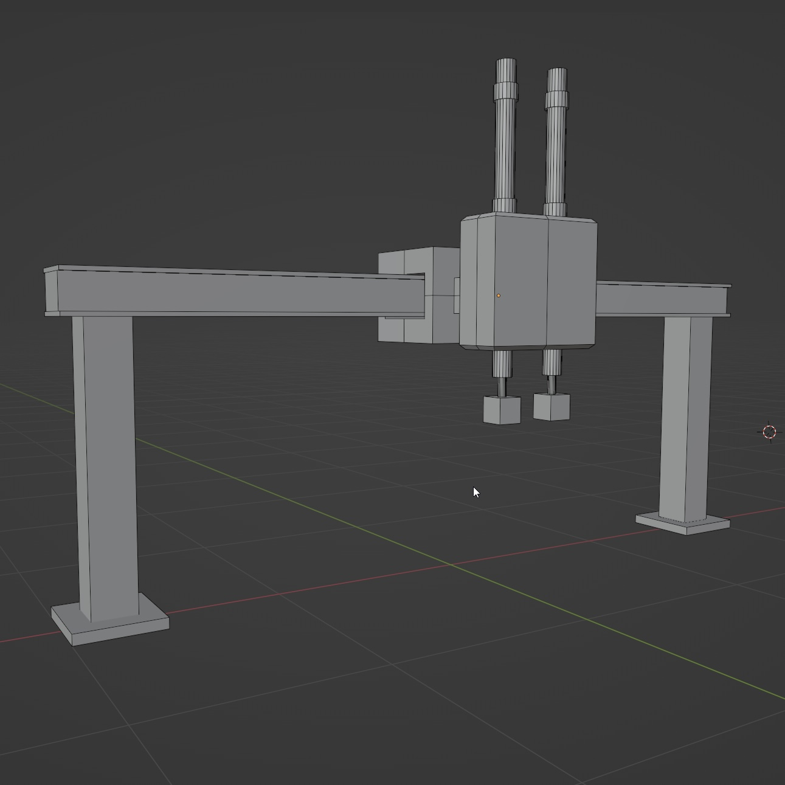
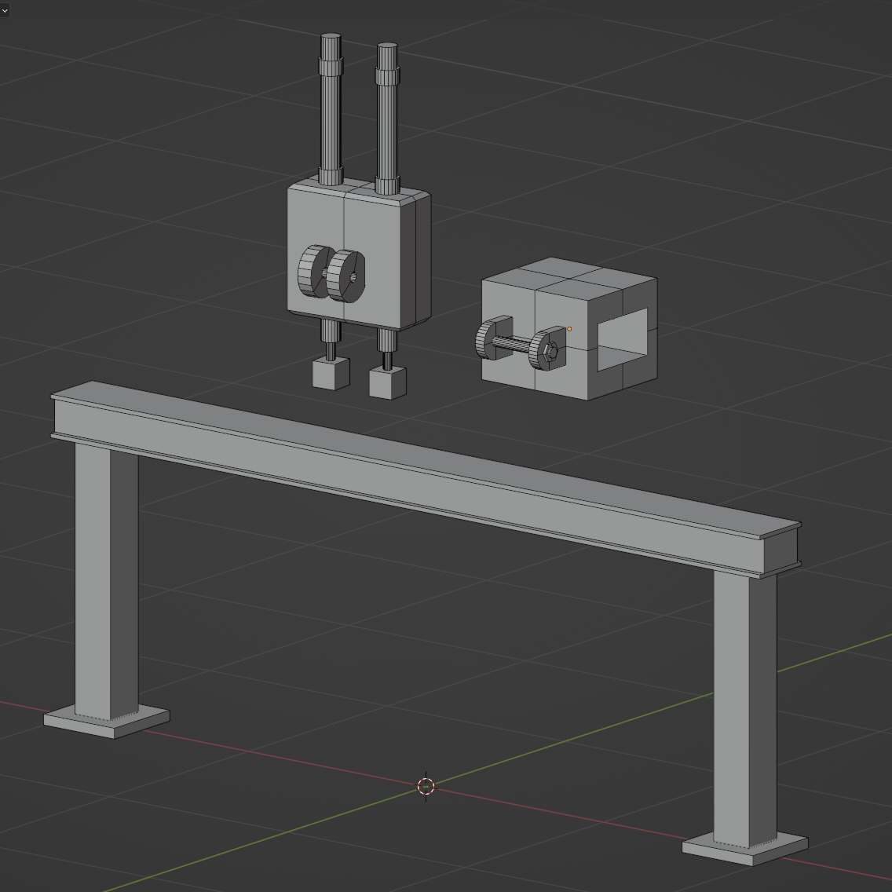

# Computer Graphics Labs (OpenGL)

Репозиторий содержит лабораторные работы по дисциплине «Компьютерная графика».

## Структура проекта

- В одном решении Visual Studio размещены отдельные проекты: `Lab_1`, `Lab_2`, `Lab_4`, ...
- Библиотеки лежат в корне решения:
  - `glew-2.1.0/`
  - `glfw-3.4.bin.WIN64/`
  - `glm/`
  - `glad/`
- Ресурсы (модели/изображения) лежат в `assets/`

## Запуск

Открыть решение в Visual Studio и запустить нужный проект `Lab_*` как Startup Project (ПКМ по проекту -> Set as Startup Project).

---

## Лабораторная работа №1: 
### Настройка Visual Studio + базовый OpenGL 1.0

**Цель:** настроить проект Visual Studio для работы с GLFW + GLEW, создать контекст и рендер фигуры по варианту (квадрат).

**Результат:**
- подключены зависимости GLFW/GLEW
- создаётся окно и OpenGL-контекст
- реализован рендер фигуры

---

## Лабораторная работа №2: 
### Cовременный OpenGL 4.6, VAO/VBO/EBO + шейдеры

**Цель:** перейти на современный OpenGL (Core Profile) и создать рендер фигуры через буферы и шейдеры.

**Результат:**
- фигура (квадрат) рисуется треугольниками через **VAO/VBO/EBO**
- используются **vertex/fragment shaders**
- цвет фигуры меняется по времени через `glfwGetTime()` + `sin/cos` (uniform)
- шейдеры вынесены в файлы `.vert/.frag`
- добавлен простой класс/модуль `Shader` для:
  - чтения шейдеров из файлов
  - компиляции/линковки
  - передачи uniform в одну строку

---

## Лабораторная работа №3: 
### Cоздание 3D-модели в Blender

Файл модели Blender находится в папке: `assets/blender_model_M20C/`

- `Lab3_V10_M20C.blend` - исходник Blender  

Модель промышленного робота М20Ц выполнена примитивами и разделена на подвижные группы для трёх степеней подвижности:

- **1-я степень** - линейное перемещение по ходовым балкам  
- **2-я степень** - поворот модуля в вертикальной плоскости (**ограничение ±22°**)  
- **3-я степень** - линейное перемещение вдоль направления наклона второй степени

#### Иерархия (Parenting)

`Каретка` parent → `Модуль манипулятора (бокс)` parent → `Руки`

#### Ограничения трансформаций (Constraints)

- **Каретка** - перемещение вдоль балки по **локальной оси X**  
  (*Limit Location* по X)

- **Модуль манипулятора (бокс)** - наклон по **локальной оси X** с ограничением **22°**  
  (*Limit Rotation* по X)

- **Руки** - перемещение вверх/вниз по **локальной оси Z**  
  (*Limit Location* по Z)  
  При наклоне модуля руки наклоняются вместе с ним (наследуют трансформации родителя).

#### Изображения

**Общий вид**

**Элементы модели**

**Вид на соединение**

---

## Лабораторная работа №4: 
### Движение камеры, использование матриц, работа с библиотекой glm

**Цель:** реализовать 3D-сцену с управлением перемещением камеры через WASD и мышь.

**Результат:**
- отрисовывается 3D-объект (куб)
- матрицы передаются в шейдер как `uniform mat4`:
  - `projection` (perspective)
  - `view` (камера)
  - `model` (объект)
  - `transform` (доп. преобразование)
- управление камерой:
  - **W/A/S/D** - перемещение
  - **мышь** - поворот камеры
  - **Esc** - выход (закрытие окна)

---

## Лабораторная работа №5:
### Подключение ASSIMP и импорт модели (.obj)

**Цель:** подключить библиотеку **ASSIMP** и реализовать импорт 3D-модели в формате **.obj** для дальнейшего рендера и работы с данными модели.

**Результат:**
- библиотека **ASSIMP** подключена к проекту (include/lib/dll);
- реализована загрузка `.obj` через `Assimp::Importer::ReadFile(...)`;
- выполнен разбор структуры модели **Scene → Node → Mesh** с рекурсивным обходом узлов сцены;
- реализованы классы **Model** и **Mesh**:
  - `Mesh` хранит вершины *(позиция + нормаль)* и индексы, настраивает **VAO/VBO/EBO** и отрисовывается через `glDrawElements`;
  - `Model` загружает сцену Assimp, извлекает меши и отрисовывает модель как набор мешей;
- добавлена плоская заливка модели цветом через `uniform vec3 lightColor`.

**Модель для проверки:**
- протестировано на тестовой OBJ-модели (cube-заглушка);
- также выполнен импорт и отображение собственной модели из `assets/blender_model_M20C/` (экспорт `.obj/.mtl` из Blender).

### Управление камерой
Для удобства осмотра модели добавлено управление камерой (как в Lab_4):
- **W/A/S/D** - перемещение
- **мышь** - поворот
- **Esc** - выход

### Результат работы

