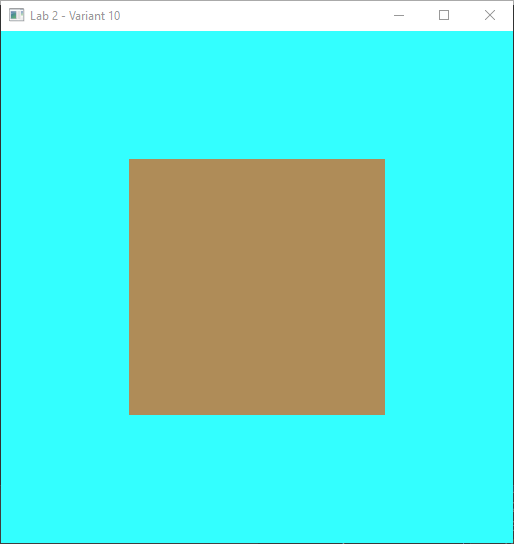
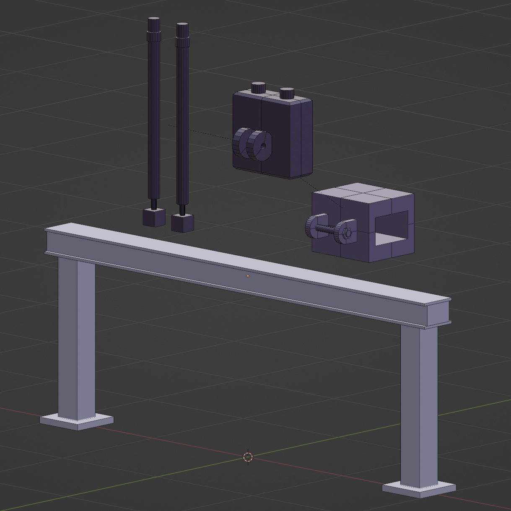
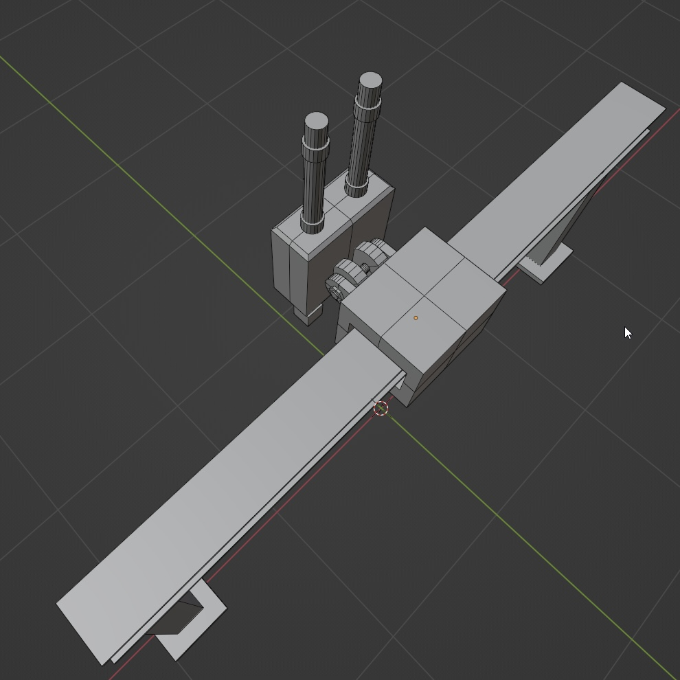
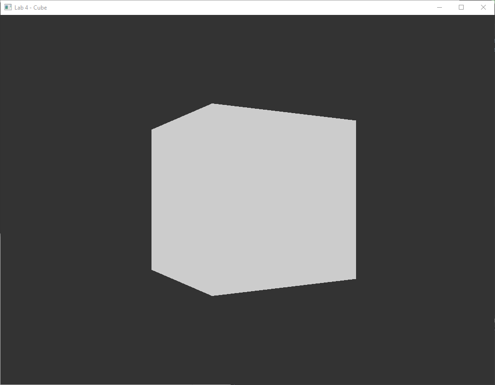
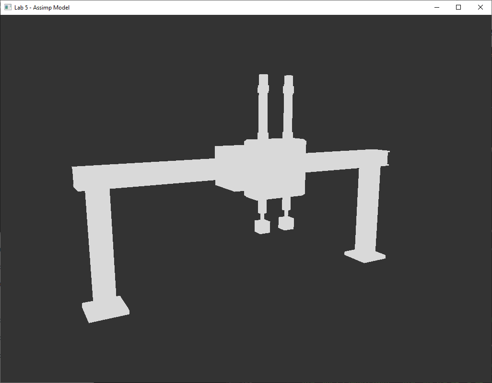
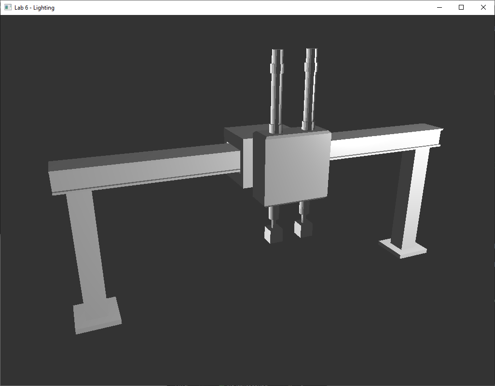
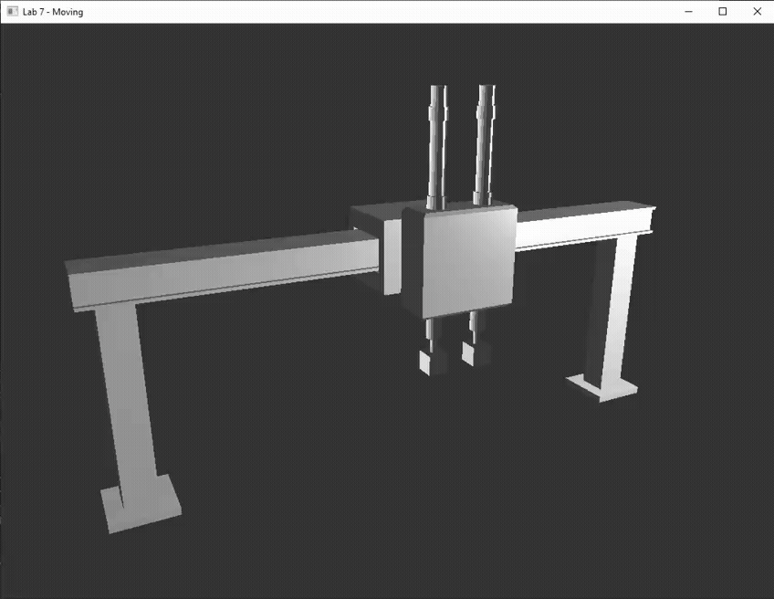

# Computer Graphics Labs (OpenGL)

Репозиторий содержит лабораторные работы по дисциплине «Компьютерная графика».

## Структура проекта

- В одном решении Visual Studio размещены отдельные проекты: `Lab_1`, `Lab_2`, `Lab_4`, `Lab_5`, `Lab_6`, `Lab_7`.
- Библиотеки лежат в корне решения:
  - `glew-2.1.0/`
  - `glfw-3.4.bin.WIN64/`
  - `glm/`
  - `glad/`
  - `assimp/`
- Ресурсы (модели/изображения) лежат в `assets/`

## Запуск

Открыть решение в Visual Studio и запустить нужный проект `Lab_*` как Startup Project (ПКМ по проекту -> Set as Startup Project).

---

## Лабораторная работа №1:
### Настройка Visual Studio для работы с OpenGL. Создание контекста и рендера.

**Цель:** настроить проект Visual Studio для работы с OpenGL, создать окно и контекст, а также реализовать базовый рендер фигуры по варианту с использованием OpenGL 1.0. 

### Основные идеи
В первой лабораторной работе подготавливается базовая среда для дальнейших проектов.  
Проект настраивается для работы с библиотеками **GLFW** и **GLEW**, после чего создаются окно приложения, OpenGL-контекст и простой цикл рендера.  
Используется классический рендер на **OpenGL 1.0**, который служит основой для перехода к современному OpenGL в следующих лабораторных работах.  

### Что реализовано
- настроен проект Visual Studio для работы с **GLFW**, **GLEW** и **OpenGL**; 
- создано окно приложения и инициализирован OpenGL-контекст через **GLFW**; 
- выполнена инициализация **GLEW** для доступа к функциям OpenGL; 
- реализован основной цикл программы: очистка кадра, отрисовка, смена буферов и обработка событий окна; 
- выполнен базовый рендер фигуры по варианту с помощью `glBegin(...)`, `glVertex...`, `glColor...` и `glEnd()`; 
- настроены цвет фигуры и цвет фона в соответствии с вариантом задания;
- дополнительно выводится информация о версии OpenGL и используемом устройстве. 

### Результат
Подготовлена база для дальнейших заданий по OpenGL: проект настроен, окно и контекст создаются корректно.  
На экране отображается квадрат.  

---

## Лабораторная работа №2:
### Современный OpenGL 4.6, VAO/VBO/EBO и шейдеры.

**Цель:** на основе проекта из предыдущей лабораторной работы перейти к современному OpenGL и реализовать рендер с использованием **VBO**, **VAO**, **EBO** и шейдерных программ, а также добавить элементы движения объекта.

### Основные идеи
Во второй лабораторной работе выполняется переход от устаревшего способа рисования к современному OpenGL.  
Данные вершин размещаются в буферах на стороне видеокарты, конфигурация вершинных атрибутов сохраняется в **VAO**, а обработка вершин и цвета переносится в **GLSL-шейдеры**.  
Дополнительно в работу вводятся `uniform`-переменные и простая анимация цвета объекта во времени.  

### Что реализовано
- проект переведён на использование **OpenGL 4.6 Core Profile**;
- геометрия фигуры хранится в буферах **VBO** и **EBO**, а конфигурация атрибутов вершин - в **VAO**; 
- настроены вершинные атрибуты через `glVertexAttribPointer(...)` и `glEnableVertexAttribArray(...)`; 
- добавлены **vertex shader** и **fragment shader** на языке **GLSL**;
- реализована передача `uniform`-переменных в шейдерную программу;
- добавлено изменение цвета фигуры во времени с использованием `glfwGetTime()` и периодических функций; 
- шейдеры вынесены в отдельные файлы `.vert` и `.frag`;
- создан вспомогательный класс **Shader** для загрузки шейдеров из файлов, компиляции, линковки и удобной передачи `uniform`-переменных;
- для изменения цвета используется передача `uniform vec4` в fragment shader. 

### Особенности реализации
В отличие от первой лабораторной работы, вершины больше не передаются по одной в момент рисования.  
Они заранее загружаются в память видеокарты, а их обработка выполняется через программируемые шейдеры.  

### Результат
Реализован рендер фигуры средствами современного OpenGL: используются буферы, шейдерные программы и `uniform`-переменные.  
На экране отображается квадрат, у которого со временем плавно меняется яркость цвета.  

---

## Лабораторная работа №3: 
### Cоздание 3D-модели в Blender

Файл модели Blender находится в папке: `assets/blender_model_M20C/`

- `Lab3_V10_M20C.blend` - исходник Blender

**Цель:** создать в Blender 3D-модель по своему варианту с сохранением дробления по типу и группе движения для первых трёх степеней подвижности.

### Основные идеи
Передать общую форму конструкции по референсу и правильно разделить её на подвижные части.  
Эта структура будет служить основой для последующего импорта модели в OpenGL, настройки освещения и реализации движения в следующих лабораторных работах.  

### Что реализовано
- создана 3D-модель промышленного робота **М20Ц**;
- подвижные элементы разделены на отдельные группы для трёх степеней подвижности;
- подготовлена иерархия зависимых частей (**parenting**), чтобы дочерние элементы наследовали движение родителя;
- добавлены ограничения трансформаций (**constraints**) для контроля движения частей модели. 

### Структура модели
Для модели заданы три степени подвижности:

- **1-я степень** - линейное перемещение по ходовым балкам;
- **2-я степень** - поворот модуля в вертикальной плоскости;
- **3-я степень** - линейное перемещение рук вдоль направления наклона второй степени.

### Особенности реализации
Иерархия частей организована так:

`Каретка` parent → `Модуль манипулятора (бокс)` parent → `Руки`

Ограничения заданы через трансформации Blender:

- **каретка** - перемещается вдоль балки по **локальной оси X**;
- **модуль манипулятора** - наклоняется по **локальной оси X** с ограничением по углу в **22°**;
- **руки** - перемещаются по **локальной оси Z** и наследуют наклон родительского модуля. 

### Результат
Подготовлена составная 3D-модель робота **М20Ц**, разбитая на подвижные части.  

**Общий вид**

**Элементы модели**

**Вид на соединение**

---

## Лабораторная работа №4:
### Движение камеры, использование матриц. Работа с библиотекой glm.

**Цель:** реализовать управление камерой в 3D-сцене с использованием матриц и библиотеки **GLM**.

#### Основные идеи
Переход к 3D-навигации: в этой лабораторной работе сцена становится полноценной 3D-сценой, в которой можно свободно осматриваться с помощью камеры.  
Для этого в проект добавляются матрицы **projection**, **view**, **model** и **transform**, а также библиотека **GLM** для работы с векторами и преобразованиями.  
Камера управляется с клавиатуры и мыши, а все изменения сразу отражаются в рендере.  

### Что реализовано
- подключена библиотека **GLM** для работы с векторами и матрицами;
- в шейдер добавлены матрицы **projection**, **view**, **model** и **transform**;
- реализована перспектива через `glm::perspective(...)`;
- реализована камера через `glm::lookAt(...)`;
- добавлены базовые параметры камеры: положение, направление взгляда и вектор "вверх" (куда направлена её вертикаль);
- реализовано управление камерой с клавиатуры (**W / A / S / D**);
- реализован поворот камеры мышью через углы **yaw / pitch**;
- добавлены ограничения по углу `pitch`, чтобы камера не переворачивалась;
- курсор фиксируется внутри окна для удобного управления;
- для корректного отображения 3D-сцены включён **depth test** - тест глубины, чтобы грани отображались корректно при движении камеры.

### Особенности реализации
Для движения камеры используется `deltaTime`, поэтому скорость перемещения не зависит от FPS.  
Отдельно используется дополнительная матрица **transform**, через которую задаётся фиксированный поворот объекта.  
Это позволяет на практике увидеть разницу между положением камеры, положением объекта и перспективным преобразованием.  

### Управление

**Клавиатура - перемещение**
- **W/S** - движение вперёд/назад
- **A/D** - движение влево/вправо

**Мышь - осмотр:**
- мышь поворачивает камеру и меняет направление взгляда

### Рендер сцены
- Для демонстрации работы матриц и камеры отрисовывается 3D-объект: куб.
- Дополнительно можно включать режим каркаса `GL_LINE`, чтобы видеть только рёбра.

### Результат
Реализована 3D-навигация по сцене с помощью камеры.  
Куб отображается с перспективой, корректно реагирует на матрицы преобразования, а сцену можно осматривать с разных ракурсов.

---

## Лабораторная работа №5:
### Подключение ASSIMP и импорт модели (.obj)

**Цель:** подключить библиотеку **ASSIMP** и реализовать импорт 3D-модели в формате **.obj** для дальнейшего рендера и работы с данными модели.

**Результат:**
- библиотека **ASSIMP** подключена к проекту (include/lib/dll);
- реализована загрузка `.obj` через `Assimp::Importer::ReadFile(...)`;
- выполнен разбор структуры модели **Scene → Node → Mesh** с рекурсивным обходом узлов сцены;
- реализованы классы **Model** и **Mesh**:
  - `Mesh` хранит вершины *(позиция + нормаль)* и индексы, настраивает **VAO/VBO/EBO** и отрисовывается через `glDrawElements`;
  - `Model` загружает сцену Assimp, извлекает меши и отрисовывает модель как набор мешей;

- добавлена плоская заливка модели цветом через `uniform vec3 lightColor`.

**Модель для проверки:**
- протестировано на тестовой OBJ-модели (cube-заглушка);
- также выполнен импорт и отображение собственной модели из `assets/blender_model_M20C/` (экспорт `.obj/.mtl` из Blender).

**Управление камерой:**

Для удобства осмотра модели добавлено управление камерой (как в Lab_4):
- **W/A/S/D** - перемещение
- **мышь** - поворот камеры
- **Esc** - выход

### Результат работы

---

## Лабораторная работа №6:
### Настройка освещения с использованием шейдерных программ

**Цель:** настроить освещение 3D-модели в OpenGL с помощью шейдеров.

**Результат:**
- реализовано освещение по модели **Фонга**:
  - **ambient** - фоновая подсветка, чтобы объект не был полностью тёмным;
  - **diffuse** - светотень в зависимости от угла к источнику света (рассеянный свет)
  - **specular** - блики, зависят от положения камеры и параметра блеска (*shininess*);
- используются **нормали вершин**  модели для корректного расчёта освещения;
- добавлены параметры:
  - источника света (позиция и интенсивности) `light.*`
  - материала (цвет и блеск) `material.*`;
- применена *матрица нормалей* **normalMatrix** для корректного преобразования нормалей при трансформациях модели (поворот/масштабирование);
- в качестве 3D-объекта используется импортированная через **Assimp** модель робота М20Ц;
- сохранено управление камерой для осмотра сцены (как в предыдущих работах):

  - **W/A/S/D** - перемещение
  - **мышь** - поворот
  - **Esc** - выход

### Результат работы

---

## Лабораторная работа №7:
### Создание движения через аффинные преобразования

**Цель**: реализовать движение составной 3D-модели в OpenGL с помощью аффинных преобразований и библиотеки GLM.

### Основные идеи

В работе к уже загруженной и освещённой 3D-модели добавляется движение отдельных частей.
Для этого составная модель разбивается на логические элементы, и каждая часть получает свою матрицу преобразования.

Используются базовые аффинные преобразования:

- **translate** - для линейного перемещения частей модели;
- **rotate** - для поворота подвижного модуля вокруг шарнира;
- при необходимости преобразования комбинируются через умножение матриц.

### Структура модели
В качестве 3D-объекта используется импортированная через **Assimp** модель промышленного робота **М20Ц**, состоящая из нескольких частей:

- **Beam** - балка;
- **Carriage** - каретка;
- **ManipulatorBox** - модуль манипулятора;
- **Arms** - руки.

### Реализованное движение
Для модели реализованы **3 степени подвижности**:

- перемещение каретки вдоль балки;
- поворот модуля манипулятора в шарнире;
- перемещение рук относительно модуля манипулятора.

Преобразования организованы по иерархии зависимых частей:

- каретка перемещается вдоль балки независимо;
- модуль манипулятора наследует смещение каретки и дополнительно поворачивается;
- руки наследуют и смещение каретки, и поворот модуля, после чего получают собственное перемещение.

Таким образом реализована простая иерархическая кинематическая схема:
**балка** → **каретка** → **модуль манипулятора** → **руки**.

### Особенности реализации
В программе:

- части модели отрисовываются **раздельно**;
- для каждого меша задаётся **своя `model`-матрица**;
- для корректного освещения при движении каждой части пересчитывается **матрица нормалей `normalMatrix`**;
- для подвижных частей заданы **ограничения по перемещению и углу поворота**.

### Управление
Сохранено управление камерой для осмотра сцены:

- **W / A / S / D** - перемещение;
- **мышь** - поворот;
- **Esc** - выход.

Добавлено управление подвижными частями модели:

- **Left / Right** - перемещение каретки;
- **R / T** - наклон модуля манипулятора;
- **Up / Down** - перемещение рук.

### Результат работы
- В результате лабораторной работы реализовано движение составной 3D-модели робота с помощью аффинных преобразований.  
- Подвижные части управляются отдельно, при этом сохраняется зависимость между частями модели и корректное освещение сцены.

